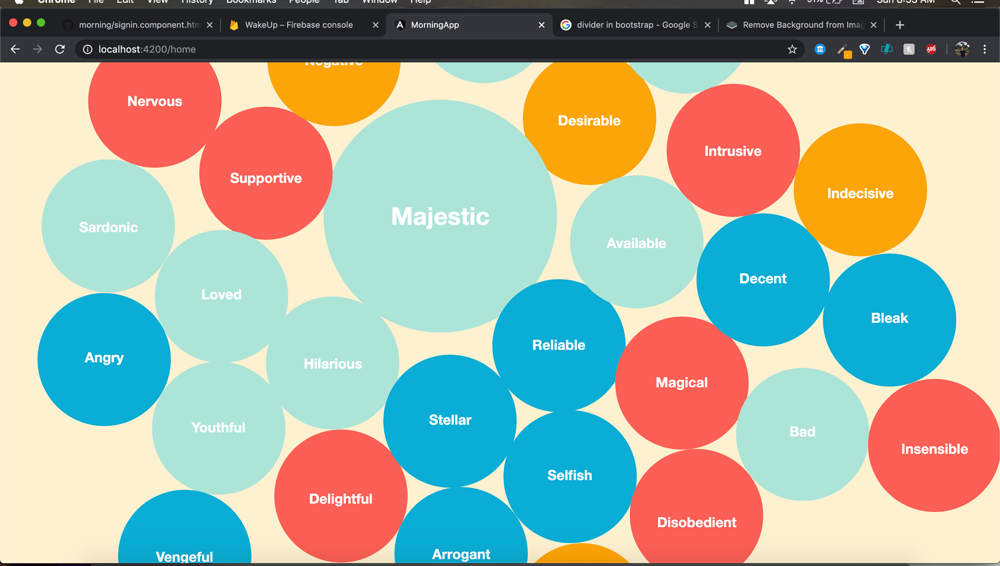

# morning

Mornings are hard. That's something almost everyone can agree on. We're groggy, usually running a bit late, and trying to get our days started as soon as possible. That usually involves checking our emails from the past night, checking our calendars and trying to make sense of our hectic schedules, catching up on news, checking the weather, checking our messages, etc... We thought that this entire process was tedious and made mornings harder than they already are.

Morning provides a unique unified platform designed to make mornings easier. It presents the user with a customizable unified dashboard with everything a user could need in the morning in one sleek and easy to use interface. What makes Morning unique over over lifestyle apps is that it helps you self-diagnose your mood and motivation level by asking you how you're feeling every morning, and then generates a score everyday based on sentiment analysis of the choices selected. We present graphics of personalized data to make interpretation easy and satisfying to look at. We hope that taking a moment to reflect every morning, combined with a little dash of positivity, can help center our users and prepare them for all that the day has to offer. 

We built morning with an Angujar.js framework and Firebase for storage.

For the future, we're hoping to integrate more mental health-focused features and make mental health resources more accessible to every user.

